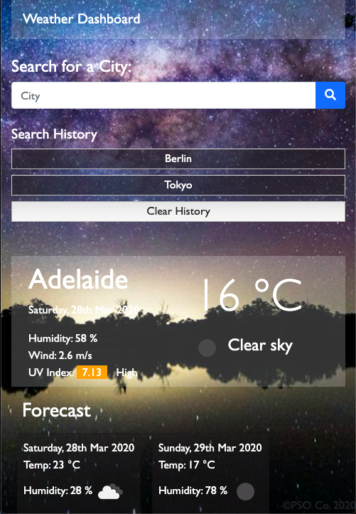

WeatherApp
<ul>
<li>Onload the default city is set to Adelaide</li>
<li>Weather details and forecast is displayed to user</li>
<li>To search for new city, user enter city name into searchbox and click on search btn</li>
<li>if no data was entered before clicking search btn, modal display input needed will appear</li>
<li>if data entered was not matched with any city via API,modal display nil result will appear</li>
<li>Searched city will be added to local storage and display in the first line of history section</li>
<li>Searh history limited to 5</li>
<li>If searched city already existed in history, it will not be added</li>
<li>To displays weather details for previously searched city, user click on the city name displayed in history section</li>
<li>To clear history, user click on clear history btn</li>
<li>Background image change with the hour number of the day</li>

</ul>
<a href='https://a1718367.github.io/weatherApp/'>Weather App</a>
